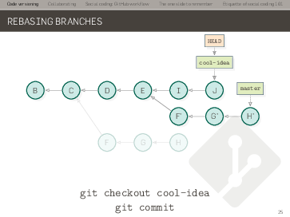
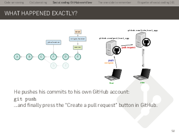
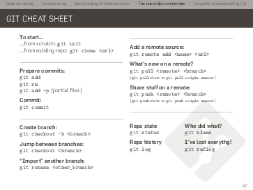

GIT: the basics
---------------

A ~2h-long introduction to GIT, covering:

- the basics of code versioning
- understanding branching and merging
- collaborative development
- git hosting with GitHub
- the 'etiquette' of collaborative coding
- a few principles of software engineering

[Download the slides](slides.pdf)

The slides are made available under a Creative Commons CC-BY-SA license (you can
freely re-use and modify the material as long as you mention me as the original
author and re-share the modified version).
